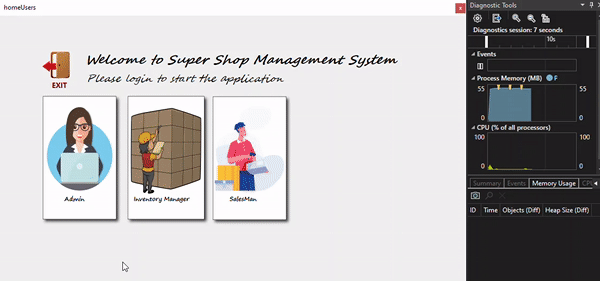

# superShop_management_system
its a superShop management system, where we have two kind of user 
1. Admin
2. Inventory Manager
3. salesMan

Duty of Admin
- Create inventory-manager and salesman accounts.
  -Name
  -Pass
  -Mobile 
  -age
-Transaction 
  -Transaction_id
  -Total
  -date

 
Admin Interface
 

 
 
Duty of inventory manager

-Add product 
-Delete product 
-Update product
-Print summary of the entire product wirehouse 

 
 
Duty of salesMan

-Make bill : 
-meanwhile update the inventory and  
-print the receipts what's ordered by the customer.

